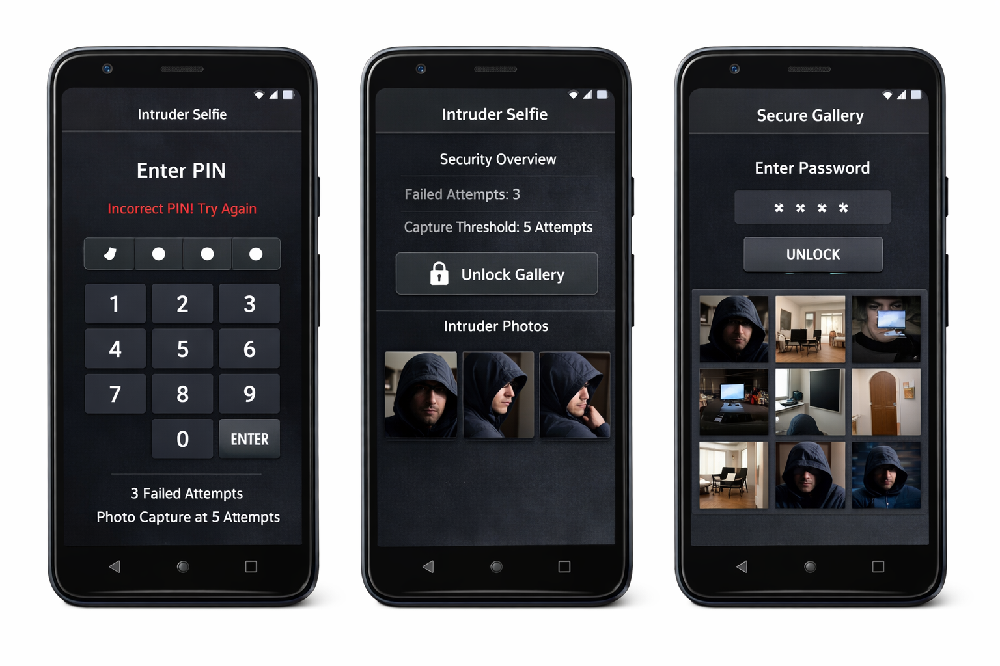

# Intruder Selfie - UI Prototype

This is a Kotlin-based Android application built with **Jetpack Compose**. It serves as a UI prototype for a security application designed to capture "intruder selfies" when unauthorized access attempts are made.

## 📱 App UI Mockups
Here's a preview of the prototype screens:

## Current Features (UI Prototype)
*   **Lock Screen Simulation:** A secure-looking interface for PIN entry.
*   **Security Overview:** Displays the current status of failed attempts and capture thresholds.
*   **Protected Gallery:** A mock evidence gallery that is only accessible after entering the correct owner password.
*   **Password Logic:** Local validation for the prototype flow.

## How to Run the App

### Prerequisites
1.  **Android Studio:** Download and install the latest version of [Android Studio](https://developer.android.com/studio) (Hedgehog or newer recommended).
2.  **Java Development Kit (JDK):** The project uses Java 11 (handled automatically by modern Android Studio).
3.  **Android Device/Emulator:** A physical Android device or an Android Virtual Device (AVD) running **Android 7.0 (API 24)** or higher.

### Steps to Run
1.  **Open the Project:**
    *   Launch Android Studio.
    *   Select **Open** and navigate to the project folder: `Intruder_serlfie`.
2.  **Gradle Sync:**
    *   Wait for Android Studio to finish syncing the Gradle files. You should see a "Build successful" message in the sync tab.
3.  **Select a Device:**
    *   In the top toolbar, select your connected physical device or a created emulator from the dropdown menu.
4.  **Run the App:**
    *   Click the green **Run** button (play icon) or press `Shift + F10`.
    *   The app will compile, install, and launch on your device.

## Prototype Usage
*   **Sample Owner Password:** For this UI prototype, use the code **`2468`** to unlock the gallery.
*   **Exploration:** Toggle between the "Lock Screen" and "Gallery" tabs to see how the UI responds to locked/unlocked states.

## Project Structure
*   `MainActivity.kt`: Contains the primary UI logic and Compose screens.
*   `build.gradle.kts`: Project and app-level build configurations.
*   `libs.versions.toml`: Centralized dependency management.

## CI/CD Release Workflow
This repo now includes a GitHub Actions workflow at `.github/workflows/mobile-release.yml`.

What it does:
* Builds Android release artifacts (`.apk` and `.aab`).
* Uploads artifacts to the workflow run for download.
* On tag pushes like `v1.0.0`, attaches artifacts to a GitHub Release.
* Attempts an iOS release build only when an `ios/` Xcode project/workspace exists.

Optional Android signing secrets:
* `ANDROID_KEYSTORE_BASE64`
* `ANDROID_KEYSTORE_PASSWORD`
* `ANDROID_KEY_ALIAS`
* `ANDROID_KEY_PASSWORD`

Without signing secrets, Android release artifacts are still built, but are not production-signed.

---
*Note: This version is a UI-only prototype. Real camera integration, persistent storage (Room), and biometric authentication are planned for future versions.*
